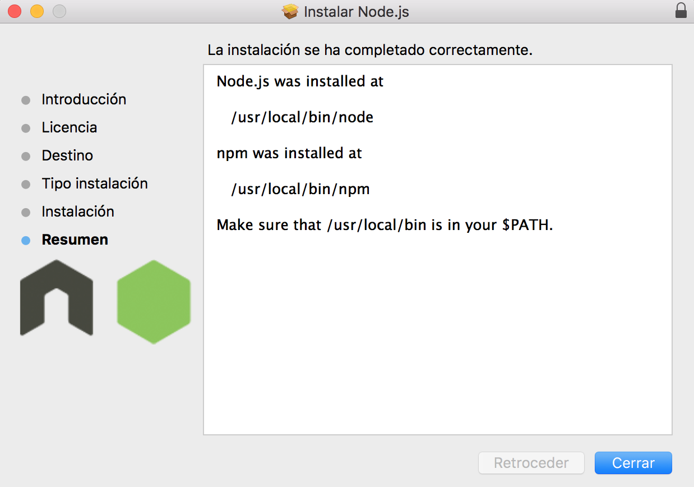
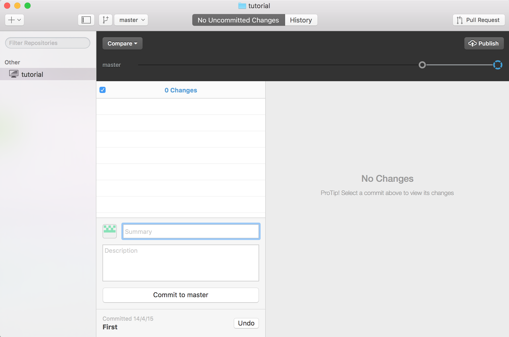
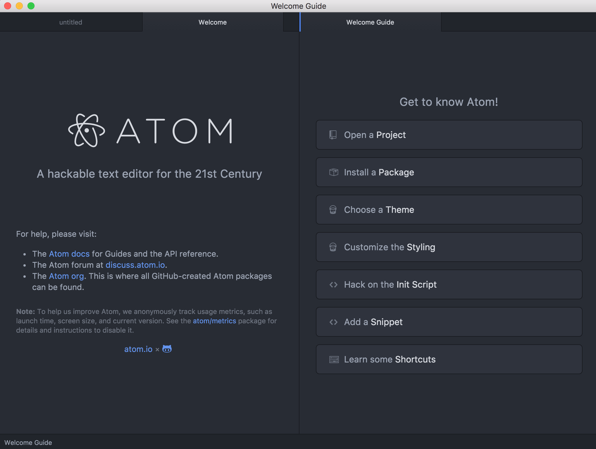
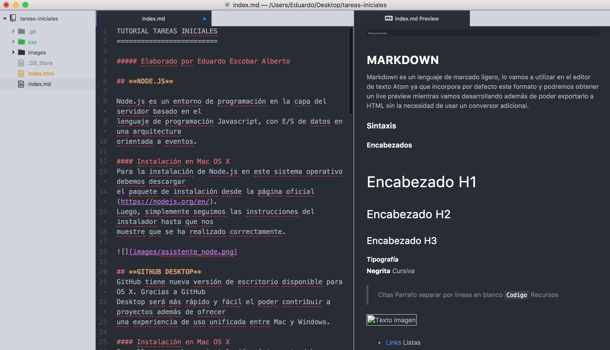
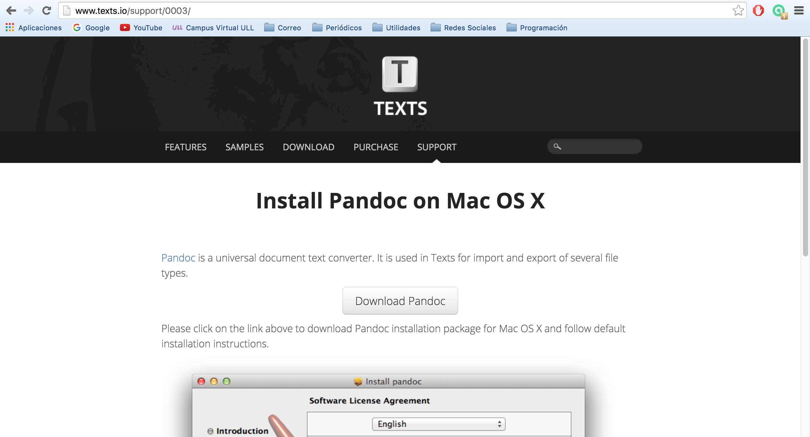
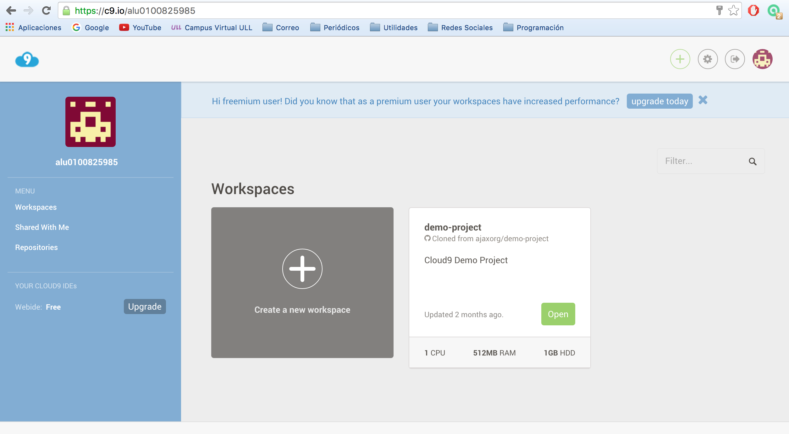
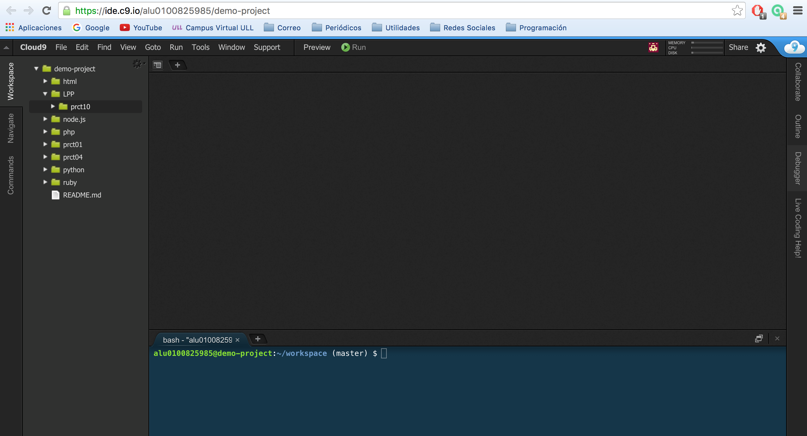

TUTORIAL TAREAS INICIALES
=========================

##### Elaborado por Eduardo Escobar Alberto

## **NODE.JS**

Node.js es un entorno de programación en la capa del servidor basado en el
lenguaje de programación Javascript, con E/S de datos en una arquitectura
orientada a eventos.

#### Instalación en Mac OS X
Para la instalación de Node.js en este sistema operativo debemos descargar
el paquete de instalación desde la página oficial (https://nodejs.org/en/).
Luego, simplemente seguimos las instrucciones del instalador hasta que nos
muestre que se ha realizado correctamente.

## **GITHUB DESKTOP**
GitHub tiene nueva versión de escritorio disponible para OS X. Gracias a GitHub
Desktop será más rápido y fácil el poder contribuir a proyectos además de ofrecer
una experiencia de uso unificada entre Mac y Windows.

#### Instalación en Mac OS X
Para llevar a cabo su instalación, únicamente debemos descargarnos el software
desde la web oficial (https://desktop.github.com/) y avanzar de forma intuitiva
hasta completar la instalación.

## **ATOM**
Atom es un editor de texto orientado a la elaboración de aplicaciones. Es una
herramienta desarrollada por Github que se ha publicado como software libre.

#### Instalación en Mac OS X
La instalación de dicho editor será sencilla, simplemente debemos descargarnos
el paquete de instalación desde la página oficial (https://atom.io/) y ejecutarlo
para obtener el programa a través del asistente.

## **MARKDOWN**
Markdown es un lenguaje de marcado ligero, lo vamos a utilizar en el editor de
texto Atom ya que incorpora por defecto este formato y podremos obtener un live
preview mientras vamos desarrollando además de poder exportarlo a HTML sin la
necesidad de usar un conversor adicional.

#### Sintaxis

##### Encabezados
# Encabezado H1
## Encabezado H2
### Encabezado H3

###### Tipografía
**Negrita**
*Cursiva*
> Citas
Parrafo separar por lineas en blanco
`Codigo`

##### Recursos

* [Links](https://example.com)

##### Listas
1. Lista 1
2. Lista 2

* Lista 1
* Lista 2

## **PANDOC**
Pandoc es un conversor de texto, usado para numerosas funciones, teniendo como
una de ellas el paso de Markdown a HTML.

#### Instalación en Mac OS X
Para instalar este conversor, tenemos que descargar el paquete de instalación
desde la siguiente página (http://www.texts.io/support/0003/). Una vez instalado,
ejecutamos el siguiente comando desde la terminal: pandoc -o *nombre.md* *nombre.html*

## **CLOUD 9**
Cloud9 está perfectamente indicado para el trabajo en equipo. Podemos crear un
workspace o proyecto y compartirlo con otros usuarios de este IDE. A partir de
entonces podemos compartir no solo el código de los archivos del servidor, sino
también la consola de comandos.

Para hacer uso de dicho entorno de desarrollo, debemos únicamente crearnos una
cuenta en su página web (https://c9.io/).

